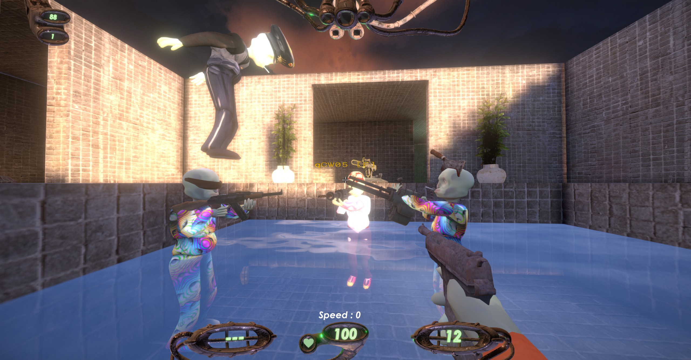

# More Strafts Players Mod

A mod that extends Straftat's multiplayer lobby max capacity from 4 players to **10 players**.

---

## Features

- **Extended Lobby Capacity:** Host lobbies with 2-10 players (up from the vanilla 2-4 limit)
- **Game Mode Support:**
  - **Free-for-All Mode:** Fully supported: each player gets their own score counter.
  - **Teams Mode:** Supported with UI limitations (see Known Limitations below)
      - **Flexible Team System:** Dropdown expanded to support as many teams as max players (e.g., 10 players = 10 team options)

---

## Installation

### Prerequisites
- Straftat (Steam version)
- [BepInEx 5.x](https://github.com/BepInEx/BepInEx/releases) installed

### Steps

1. **Install BepInEx** (if not already installed):
   - Download BepInEx 5.x (x64 version)
   - Extract all files to your Straftat game directory (where `Straftat.exe` is located)
   - Run the game once to generate BepInEx folders

2. **Install the Mod**:
   - Download `MoreStrafts.dll` from the latest release
   - Place `MoreStrafts.dll` in `<GameFolder>/BepInEx/plugins/`
   - If the `plugins` folder doesn't exist, create it

3. **Launch the Game**:
   - Start Straftat normally through Steam
   - Check the BepInEx console for: `More Strafts Mod alpha v0.0.1 by Nitrogenia loaded!`

---

## How to Use

### Creating a Lobby

1. **From Main Menu:**
   - In the **Max Players** dropdown: select your desired player count (2-10 players)
   - Click **Host**

2. **Inviting Friends:**
   - Once in the lobby, use the in-game invite system to invite Steam friends
   - **OR** share your **Lobby ID** (displayed in the lobby screen) with friends
   - Friends can join by pasting the Lobby ID into the "Join by ID" field
   - Quick match may work

3. **Teams Mode:** Each player can select their team from the dropdown (see Known Limitations below)

### ⚠️ Important Usage Notes

- **Joining 5+ player lobbies may take time:** Your screen might freeze or appear stuck for up to a couple of minutes when joining. This is normal. Be patient and do not close the game. The connection will complete successfully.
- **DO NOT change the Max Players dropdown after creating the lobby:** This is a known bug that will reset the max player count to the default 2-4 players. Set your desired player count BEFORE hosting, then leave it unchanged.
- **Free-for-All mode recommended for 5+ players:** While Teams mode works, the UI is unpatched for it.
- The host can still adjust other lobby settings (game mode, map, etc.) after creation

---

## Known Bugs and Limitations

- **Network Stability:** Testing with 5+ players has been limited. Connection stability with 5+ players may vary depending on host network conditions.

### UI Limitations
- **Player Preview Slots:** Only 4 preview slots exist in the lobby. Players 5-10 will be positioned dynamically (stacked on top).
- **End-Round Screen:** Only shows the first 4 players. Players 5-10 scores are tracked correctly but not displayed on the end-round UI.
- **Match Points HUD (Tab Menu):** Only displays up to 4 teams during matches.
- **Teams Mode Limitations:** While you can select teams for all players, the team Id selection UI will stack on top which may be difficult to choose teams as desired. Also, the in-game UI (match points HUD, end-round screen) only displays up to 4 teams. Scoring still works correctly for all teams, but visual feedback is limited. 

**Free-for-All mode is recommended for 5+ players** for the best experience.

### Not Fully Tested
⚠️ **ALPHA BUILD DISCLAIMER** ⚠️

This mod is in **early alpha** and has **NOT been extensively tested** with 5+ players in all game modes and scenarios. Issues may arise when:
- Using other mods
- Extended gameplay sessions
- Different map types
- Edge cases in team assignments

**Use at your own risk.**

---

## Bug Reports

If you encounter bugs, please report them with the following information:

### Required Information
1. **Player Count:** How many players were in the lobby when the bug occurred?
2. **Game Mode:** Teams or Free-for-All?
3. **Reproduction Steps:** Clear, step-by-step instructions to reproduce the bug
4. **Console Logs:** Copy relevant error messages from the BepInEx console
   - Console appears when you launch the game (if not, check `BepInEx/config/BepInEx.cfg` and set `Enabled = true` under `[Logging.Console]`)
